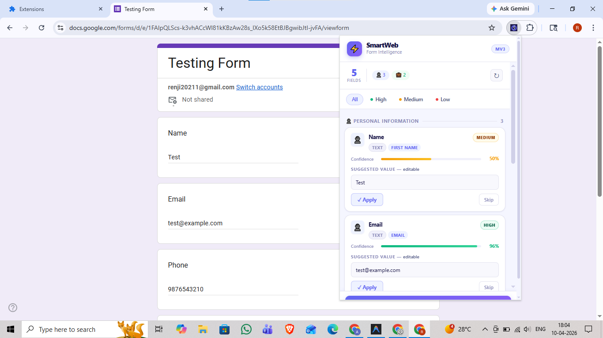
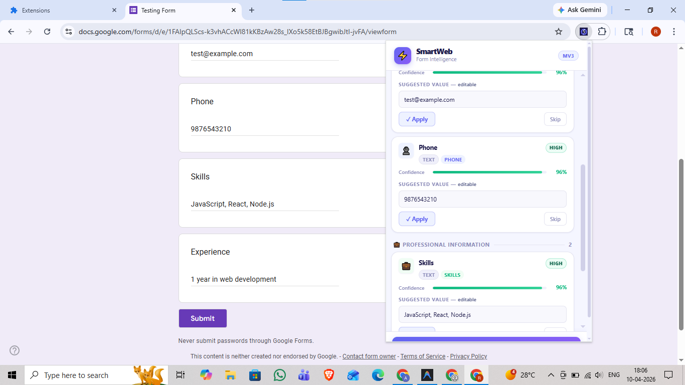
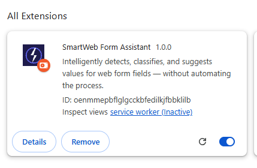

# SmartWeb Form Assistant

> A production-grade Chrome Extension that intelligently detects, classifies, and suggests values for web form fields — without automating the process away from the user.

  

---

## Screenshots

> SmartWeb in action on a Google Forms page — detecting, classifying, and filling form fields in real time.

### 📌 Personal Information Fields (Name, Email)


*The popup detects **5 fields** on the page. Name is classified as MEDIUM (50%) and Email is classified as **HIGH (96%)** — both filled and applied successfully.*

---

### 📌 Professional Information Fields (Skills, Experience)


*Phone (HIGH · 96%), Skills (HIGH · 96%), and Experience (HIGH · 98%) are all correctly classified under **Professional Information** and auto-suggested from the user profile.*

---

### 📌 Extension Installed in Chrome


*SmartWeb Form Assistant v1.0.0 installed via **Load Unpacked** in Developer Mode. No errors, enabled and ready to use.*

---

## Table of Contents

1. [Setup Instructions](#setup-instructions)
2. [Architecture Overview](#architecture-overview)
3. [Field Detection Approach](#field-detection-approach)
4. [Classification Approach](#classification-approach)
5. [Suggestion Engine](#suggestion-engine)
6. [UI & Interaction Design](#ui--interaction-design)
7. [Bonus Features](#bonus-features)
8. [Tradeoffs & Assumptions](#tradeoffs--assumptions)
9. [Assignment Requirements Checklist](#assignment-requirements-checklist)
10. [Test Sites](#test-sites)

---

## Setup Instructions

### Prerequisites
- Google Chrome (version 88+, supports Manifest V3)
- No build step required — pure HTML/CSS/JS

### Installation

1. **Clone or Download** the project folder:
   ```
   C:\Users\<you>\Desktop\SmartWeb\
   ```

2. **Open Chrome** and navigate to:
   ```
   chrome://extensions
   ```

3. **Enable Developer Mode** (toggle in the top-right corner)

4. Click **"Load unpacked"** and select the `SmartWeb` folder

5. The **SmartWeb Form Assistant** extension will appear in your toolbar  
   *(If hidden, click the 🧩 puzzle icon → pin SmartWeb)*

### Usage

1. Navigate to any webpage with a form (e.g. Google Forms, job application, signup page)
2. Click the **SmartWeb** icon in the Chrome toolbar
3. Click **⚡ Scan Page**
4. Review detected fields — each shows:
   - Inferred label
   - Category + confidence tier (HIGH / MEDIUM / LOW)
   - Editable suggested value
5. Click **✓ Apply** on individual fields, or **✨ Apply All High-Confidence** for batch fill
6. Use **Skip** to exclude specific fields from batch apply
7. Use the **tier filter tabs** (All / HIGH / MEDIUM / LOW) to focus on confident results

### After Reloading the Extension

If you edit the code and reload via `chrome://extensions → ↻`:
- Refresh the webpage you're testing on
- Then re-open the popup and scan again

---

## Architecture Overview

The extension is built as **6 modular layers** with strict separation of concerns:

```
SmartWeb/
├── manifest.json              ← MV3 manifest (permissions, scripts, popup)
├── background.js              ← Service worker (lifecycle, keep-alive)
├── content.js                 ← Intelligence engine (all 6 layers)
└── popup/
    ├── popup.html             ← Dashboard UI (5 view states)
    ├── popup.css              ← Dark-mode glassmorphism design system
    └── popup.js               ← Popup controller (render, apply, filter)
```

### Layer Architecture (`content.js`)

```
┌─────────────────────────────────────────────────────────────────┐
│  SmartWebProfile   (L1) — Extensible User Profile Schema        │
│  Grouped: personal / professional / location / social           │
├─────────────────────────────────────────────────────────────────┤
│  SmartWebDOM       (L2) — DOM Intelligence Layer                │
│  9-level label resolution · Section detection · Context graph   │
├─────────────────────────────────────────────────────────────────┤
│  SmartWebClassifier (L3) — Multi-Signal Classification Engine   │
│  5 signals · MAX scoring · Confidence tiers · Type bonuses      │
├─────────────────────────────────────────────────────────────────┤
│  SmartWebSuggestion (L4) — Context-Aware Suggestion Generator   │
│  Template picker · Select fuzzy match · Tier gating             │
├─────────────────────────────────────────────────────────────────┤
│  SmartWebRegistry  (L5) — Field Lifecycle Registry              │
│  Maps field IDs → DOM element references (never serialized)     │
├─────────────────────────────────────────────────────────────────┤
│  SmartWebInteraction (L6) — Interaction Engine                  │
│  React/Vue/Angular-compatible fill · Pulse highlight · Scroll   │
└─────────────────────────────────────────────────────────────────┘
         ↑ orchestrated by ↑
┌─────────────────────────────────────────────────────────────────┐
│  SmartWebScanner — Scan Orchestrator                            │
│  Visibility check · Section map · Sequential context · Retry   │
└─────────────────────────────────────────────────────────────────┘
```

### Message Flow

```
Popup.js ──sendMessage──▶ content.js message router
                               │
                    ┌──────────┴──────────┐
                  scan                 apply/highlight
                    │                      │
             SmartWebScanner        SmartWebInteraction
                    │
         ┌──────────┴──────────┐
      SmartWebDOM          SmartWebClassifier
         │                      │
   buildFieldContext        classify(ctx)
         │                      │
   SmartWebSuggestion  ◀────────┘
         │
     field data (serializable)
         │
Popup.js ◀──response── content.js
```

---

## Field Detection Approach

### 1. Element Selection

All visible, fillable form elements are queried:
```js
input:not([type='hidden']):not([type='submit']):not([type='button'])
  :not([type='reset']):not([type='image']):not([type='file'])
  :not([type='color']):not([type='range'])
textarea
select
```

Elements are filtered for visibility using `getBoundingClientRect()` + `getComputedStyle()` (checks `display`, `visibility`, `opacity`). Disabled and `readOnly` fields are skipped.

### 2. Context Graph Per Field

For each element, a rich **context object** is built — not just flat strings:

```js
{
  el,           // DOM reference (never serialized to popup)
  tag,          // "input" | "textarea" | "select"
  type,         // "text" | "email" | "tel" | "select" | "textarea" | ...
  label,        // resolved display label (see label resolution below)
  placeholder,  // raw placeholder attribute
  name,         // name attribute
  id,           // id attribute
  nameTokenStr, // tokenized name/id (camelCase split, noise filtered)
  nearbyText,   // direct sibling text (short, ≤100 chars each)
  sectionCtx,   // semantic section heading text above the field
  isMultiline,  // true for <textarea>
  rect,         // bounding rect (for spatial analysis)
}
```

### 3. Label Resolution (9-Level Priority Waterfall)

Labels are resolved in order of reliability. The system stops at the first successful resolution:

| Priority | Source | Why |
|---|---|---|
| 1 | `<label for="id">` | Explicit HTML association — most reliable |
| 2 | `aria-label` attribute | ARIA standard, developer-specified |
| 3 | `aria-labelledby` → referenced element text | Composite labels |
| 4 | `aria-describedby` → referenced element text | Fallback description |
| 5 | Wrapping `<label>` element | Some frameworks wrap inputs in labels |
| 6 | `title` attribute | Less common but valid |
| 7 | **Walk up 8 DOM ancestors** — find preceding sibling text | Handles Google Forms, Material UI, custom frameworks where the label `<div>` is 4–6 levels above the `<input>` |
| 8 | `placeholder` attribute (excluding generic "Your answer") | Informative but less reliable |
| 9 | `name`/`id` split (camelCase, snake_case, kebab-case) | Last resort; skips `entry.XXXXX` Google Forms IDs |

**Key innovation**: Step 7 (`_findAncestorLabel`) walks up the DOM tree instead of only checking immediate siblings. This is what makes the system work on Google Forms, where the structure is:
```
div.question-container           ← 6 levels up
  div.question-title             ← label source "Full Name *"
  div.question-body
    div.input-area
      div.input-wrapper
        input[type="text"]       ← our element
```

### 4. Section Context Detection

Before scanning fields, the engine detects semantic page sections by finding heading elements (`h1`–`h4`, `[role="heading"]`). Each field is mapped to the most recent heading above it (by Y position). This section text is used as a mild contextual bias signal during classification.

### 5. Nearby Text (Constrained)

Only **direct siblings** within the immediate parent are used as nearby text. Each sibling must be `< 100 characters` to qualify as a hint (not prose). This prevents the form's introductory description text from contaminating field classification signals.

---

## Classification Approach

### Multi-Signal Scoring

Each field is scored against **20 taxonomy categories** using **5 independent signals**:

| Signal | Source | Weight |
|---|---|---|
| `s_label` | Resolved label text | × 3.0 (highest — directly describes the field) |
| `s_placeholder` | Placeholder attribute | × 1.5 |
| `s_name` | Tokenized name/id | × 1.2 |
| `s_nearby` | Direct sibling text | × 0.7 |
| `s_section` | Section heading text | × 0.5 (ambient context) |

### MAX-of-Signals (Not Sum)

**Critical design decision**: The final score for each category uses the **maximum signal** as the primary score, not the sum of all signals:

```js
let score = Math.max(s_label, s_placeholder, s_name, s_nearby, s_section);
// Add a diminished secondary boost from the runner-up:
if (allScores[1] > 0) score += allScores[1] * 0.18;
```

**Why MAX instead of SUM?**  
Summing signals allows categories with *many keywords* to win by accumulating small fuzzy noise across all their keywords. For example, "Long Response" (13 keywords) could outscore "Email" (5 keywords) just because 13 keywords each get a tiny fuzzy match from the form description text. MAX eliminates this bias — the best single signal wins.

### Keyword Scoring Per Taxonomy Entry

Each taxonomy entry has a keyword map with weighted scores:
```js
{
  c: 'Personal Information', sc: 'Email', pk: 'email',
  kw: {
    'email address': 1.0,   // multi-word phrase, highest confidence
    'email':         1.0,
    'e-mail':        0.95,
    'your email':    0.9,
    'mail':          0.65,  // ambiguous — lower weight
  },
  tb: { email: 0.6 },        // type="email" is a very strong bonus
  sb: { contact: 0.15 },     // section context bias
}
```

For each keyword, the score function checks:
1. **Exact substring match** → full keyword weight
2. **Fuzzy multi-token match** (Levenshtein, threshold > 0.82) → keyword weight × 0.72

### Additional Scoring Modifiers

| Modifier | Effect |
|---|---|
| **Input type bonus** | `type="email"` → +0.6 to Email; `type="tel"` → +0.6 to Phone |
| **Section context bias** | If field is under "Professional" heading → +0.15 to Professional categories |
| **Textarea open-ended bonus** | Textarea → +0.35–0.45 to Open-ended categories |
| **Generic label penalty** | If label is "Your answer"/"text"/empty → multiply non-open-ended scores by 0.6 |
| **Sequential context** | If previous field was same category → +0.08 (e.g., "First Name" before "Last Name") |

### Confidence Tiers

```
Confidence = best_score / (best_score + second_best_score)

≥ 0.72  → HIGH   (green)  — strong, reliable classification
≥ 0.46  → MEDIUM (amber)  — plausible, user should review
< 0.46  → LOW    (red)    — uncertain, no suggestion generated*
```

*Exception: Open-ended fields at LOW confidence still get a generic template response.

### Taxonomy Categories

| Category | Sub-categories |
|---|---|
| Personal Information | Full Name, First Name, Last Name, Email, Phone, Address, City, State, ZIP, Country |
| Professional Information | Skills, Experience, Job Title, Company, LinkedIn, GitHub, Portfolio/Website |
| Open-ended | Cover Letter, About Yourself, Response (generic) |
| Unknown | Fallback when no category reaches threshold score |

---

## Suggestion Engine

### Profile Mapping

The user profile is organized in semantic groups (personal / professional / location / social) with a flat lookup map for O(1) suggestion retrieval. Each `profileKey` in the taxonomy maps directly to a profile field:

```js
profileKey: 'email' → SmartWebProfile.get('email') → 'test@example.com'
```

### Confidence Tier Gating

- **HIGH / MEDIUM**: Suggestion is generated and displayed
- **LOW** (non-open-ended): No suggestion — field shown with empty editable input so user can type manually

### Open-Ended Template Picker

Templates are selected by matching the **field's label/placeholder text** against keyword patterns:

| Keywords matched | Template selected |
|---|---|
| "why do you want", "motivation", "why join" | Cover Letter template |
| "about yourself", "introduce yourself" | About Yourself template |
| "goals", "aspirations", "five years" | Goals template |
| "strength", "best quality" | Strengths template |
| "project", "what have you built" | Projects template |
| *(none matched)* | Generic enthusiasm template |

All templates are kept **under 100 words** as specified.

### Select Dropdown Matching

For `<select>` elements, the suggestion engine finds the best matching option via:
1. Exact text match
2. Exact value match
3. Partial text match (contains)
4. Fuzzy Levenshtein match (threshold > 0.55)

### Editable Suggestions

Every suggestion is displayed in an **editable input/textarea** in the popup. The user can modify the text before clicking Apply. The Apply button always uses the **current value of the editable field**, not the original suggestion.

---

## UI & Interaction Design

### Popup Views

| View | Trigger |
|---|---|
| Welcome | Initial popup open |
| Loading | Scan in progress |
| Results Dashboard | Scan complete with fields found |
| Error | Chrome internal page, script injection failure |
| Empty | No visible form fields found |

### Results Dashboard

- **Stats row**: Total field count + category distribution chips
- **Tier filter tabs**: Filter cards by HIGH / MEDIUM / LOW confidence
- **Category groups**: Fields grouped by Personal / Professional / Open-ended
- **Field cards** (per field):
  - Inferred label (truncated with tooltip)
  - Type tag + Sub-category tag + Tier badge (HIGH/MEDIUM/LOW)
  - Confidence bar (color-coded: green/amber/red)
  - Editable suggestion field (textarea for open-ended, input for others)
  - Apply button (uses live editable value)
  - Skip button (toggle in/out of batch apply)
- **Apply All High-Confidence**: Batch fills only HIGH-tier fields not skipped
- **DOM-change banner**: Appears when MutationObserver detects page change → prompts re-scan

### Field Highlighting

When hovering over a field card in the popup:
- The corresponding field on the page is highlighted with an indigo pulsing outline (`@keyframes _swf_pulse`)
- The field is scrolled into view (`scrollIntoView({ behavior: 'smooth', block: 'center' })`)
- `focus()` is called to visually activate it
- Highlight auto-removes after 3.2 seconds

When a field is successfully filled:
- A green glow (`._swf_ok`) replaces the indigo highlight for 2.5 seconds

---

## Bonus Features

| Feature | Implementation |
|---|---|
| **Fuzzy string matching** | Memoized Levenshtein distance with threshold 0.82, applied to individual tokens |
| **Confidence score** | Ratio of best-to-second-best signal score, displayed as color bar |
| **`<select>` dropdown handling** | 4-tier best-match option picker (exact → partial → fuzzy) |
| **Checkbox support** | Checked if category is not Unknown |
| **MutationObserver** | Detects DOM changes (SPAs, multi-step forms), shows re-scan notice in popup |
| **Retry logic** | `scanWithRetry(3, 500ms)` — retries 3× with 500ms delay for lazy-loaded fields |
| **React/Vue/Angular compatibility** | Uses native prototype setters + dispatches `input`, `change`, `keyup` events |
| **Editable suggestions** | User can modify any suggestion before applying |
| **Tier filter tabs** | Filter field cards by confidence tier |
| **Section context detection** | Page headings provide ambient bias to classification |
| **Sequential context** | Previous field's category mildly biases the next field's classification |
| **Context validity guard** | `_ctxOk()` prevents "Extension context invalidated" crash on extension reload |

---

## Tradeoffs & Assumptions

### Tradeoffs

**1. MAX-of-signals vs. SUM-of-signals**  
Using MAX prevents keyword-count bias but means a strong secondary signal only contributes 18% — a mild correction. In practice for form fields, the dominant signal (label) is almost always the right one anyway.

**2. No AI/LLM for classification**  
Classification is entirely heuristic (keyword + fuzzy). This means zero API cost, zero latency, offline operation, and no privacy concerns (no data leaves the browser). Tradeoff: unusual field labels (e.g., "Sobriquet" for a name field) may not classify correctly without AI.

**3. Open-ended templates are static**  
Templates are pre-written and not dynamically generated. They are contextually selected but not uniquely composed per field. An optional AI API (like Gemini or OpenAI) could generate more tailored responses but adds cost, latency, and API key management.

**4. Confidence calculation is ratio-based**  
Confidence = best / (best + second). This works well when there is a clear winner but can artificially deflate confidence when two similar categories both score low (e.g., "Name" vs "First Name" for a "full name" field).

**5. Single user profile**  
The profile is hardcoded in `content.js`. Multi-profile support would require `chrome.storage.sync` and a settings UI — intentionally scoped out for this version.

**6. Content script injected on all URLs**  
The extension runs on `<all_urls>` as required. Chrome internal pages (`chrome://`, `chrome-extension://`) are filtered in the popup before scanning.

### Assumptions

1. **Forms use standard HTML elements** — `<input>`, `<textarea>`, `<select>`. Custom web components (e.g., `<input>` implemented as `<div contenteditable>`) are not detected (applies to some design systems like Quill editor).

2. **Labels appear before their inputs in the DOM** — the ancestor-label walker only looks at *preceding* siblings. Post-field labels (rare) are not resolved via ancestor walk.

3. **Section headings are short** (< 100 chars) — the system ignores headings longer than 100 characters to avoid using page titles or paragraph text as section context.

4. **User profile is static** — the sample profile (`Test User`, `test@example.com`, etc.) is embedded in `content.js`. In production, this would be loaded from `chrome.storage.local`.

5. **Fields are visible at scan time** — `scanWithRetry` handles forms that render with a slight delay (SPAs), retrying 3× with 500ms gaps. Multi-page forms that hide sections completely are handled by the MutationObserver prompting a re-scan.

6. **One form assistant operation per popup session** — the registry (`SmartWebRegistry`) is cleared on each scan. If the user scans, navigates away, and returns, they must re-scan.

---

## Assignment Requirements Checklist

| Requirement | Status |
|---|---|
| Manifest V3 | ✅ |
| Content script | ✅ `content.js` |
| Popup UI | ✅ `popup/` |
| Background script (service worker) | ✅ `background.js` |
| Runs locally via Chrome | ✅ Load unpacked |
| Detect `<input>`, `<textarea>`, `<select>` | ✅ |
| Extract: label, placeholder, input type, nearby text | ✅ + ARIA, section context, name tokens |
| Works with missing / inconsistent labels | ✅ 9-level label resolution |
| Works with non-standard DOM structures | ✅ 8-level ancestor walker |
| Personal Information (Name, Email, Phone) | ✅ |
| Professional Information (Skills, Experience) | ✅ + Company, Role, LinkedIn, GitHub |
| Open-ended Questions | ✅ Cover Letter, About Yourself, Response |
| Unknown / Other | ✅ |
| Keyword matching | ✅ |
| Heuristic classification (label, placeholder, surrounding text) | ✅ 5-signal engine |
| No hardcoding for specific websites | ✅ Generic logic |
| No static mapping for fixed forms | ✅ Dynamic scoring |
| Sample profile suggestions | ✅ |
| Apply suggestion per field | ✅ |
| Skip fields | ✅ |
| Open-ended: template-based logic | ✅ 6 context-matched templates |
| Open-ended: responses < 100 words | ✅ |
| Popup: total fields count | ✅ |
| Popup: category breakdown | ✅ |
| Popup: field label | ✅ |
| Popup: category + confidence | ✅ |
| Popup: suggested value | ✅ |
| Popup: Apply button | ✅ |
| Field highlighting in popup | ✅ Pulse animation |
| Scroll into view | ✅ |
| Works on 2+ different websites | ✅ Google Forms, Internshala, any site |
| No hardcoded selectors | ✅ |
| **Bonus**: Fuzzy matching | ✅ Levenshtein |
| **Bonus**: Dropdowns | ✅ 4-tier option matcher |
| **Bonus**: MutationObserver | ✅ |
| **Bonus**: Retry logic | ✅ 3× with 500ms |
| **Bonus**: Confidence score | ✅ Color-coded bar + tier badge |
| **Bonus**: Better UI/UX | ✅ Dark glassmorphism, editable suggestions, tier filters |

---

## Test Sites

| Site | Form Type | Notes |
|---|---|---|
| `docs.google.com/forms` | Google Forms | Deeply nested DOM, tests label resolution |
| `internshala.com` | Job application | Multi-section professional form |
| Any signup page | Standard HTML form | Tests basic classification |
| `formspree.io` | Contact form | Tests email/name/message detection |
| `typeform.com` | Single-question flow | Tests MutationObserver re-scan |

---

## File Sizes

| File | Size | Purpose |
|---|---|---|
| `content.js` | ~36 KB | Full 6-layer intelligence engine |
| `popup/popup.css` | ~16 KB | Production design system |
| `popup/popup.js` | ~8 KB | Dashboard controller |
| `popup/popup.html` | ~4 KB | UI structure |
| `manifest.json` | ~1 KB | Extension config |
| `background.js` | ~0.8 KB | Service worker |

---

*Built as a production system — designed for generalization across the entire web, not just specific forms.*
